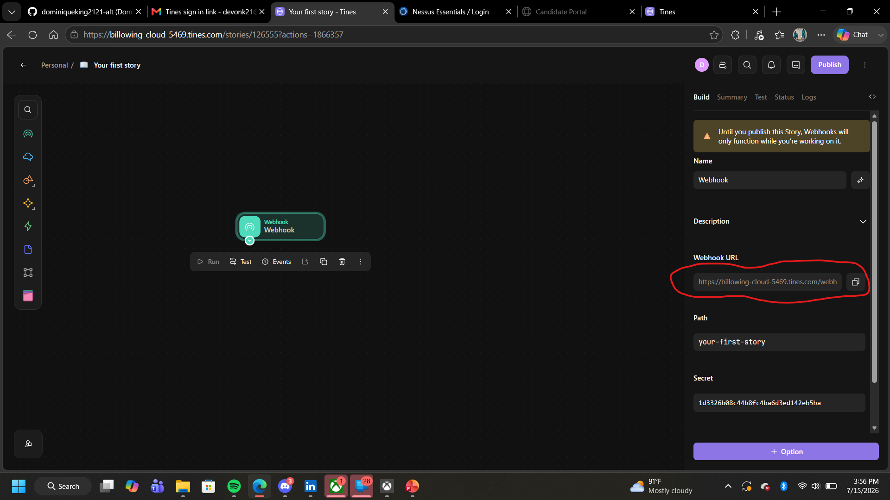
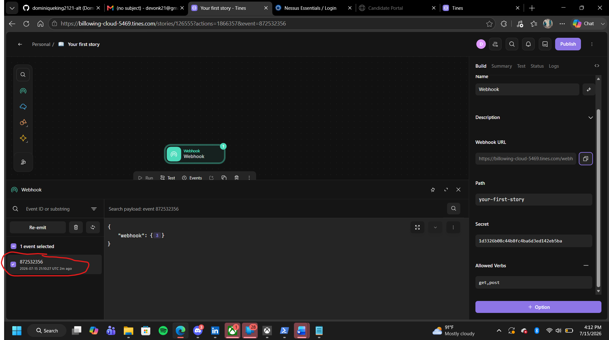
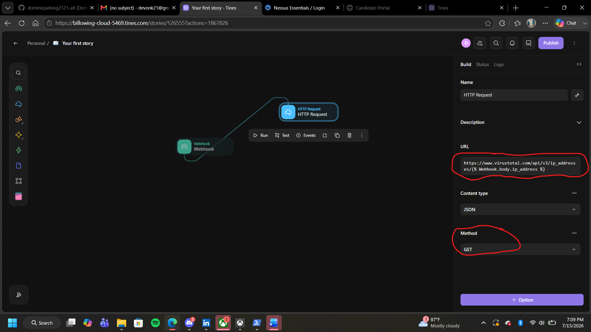
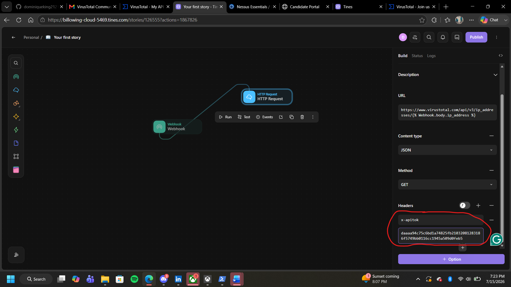
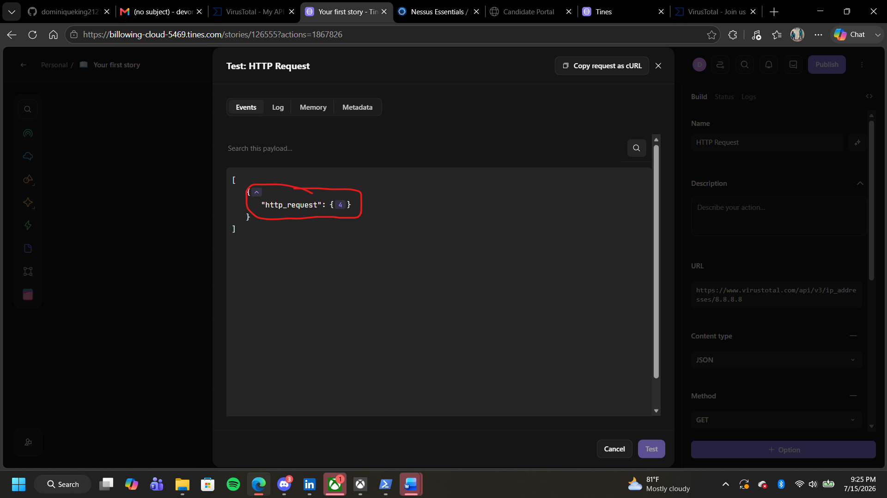
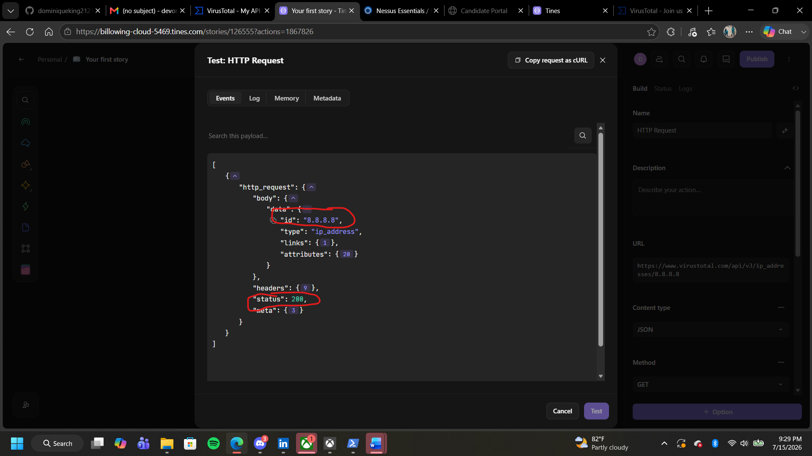
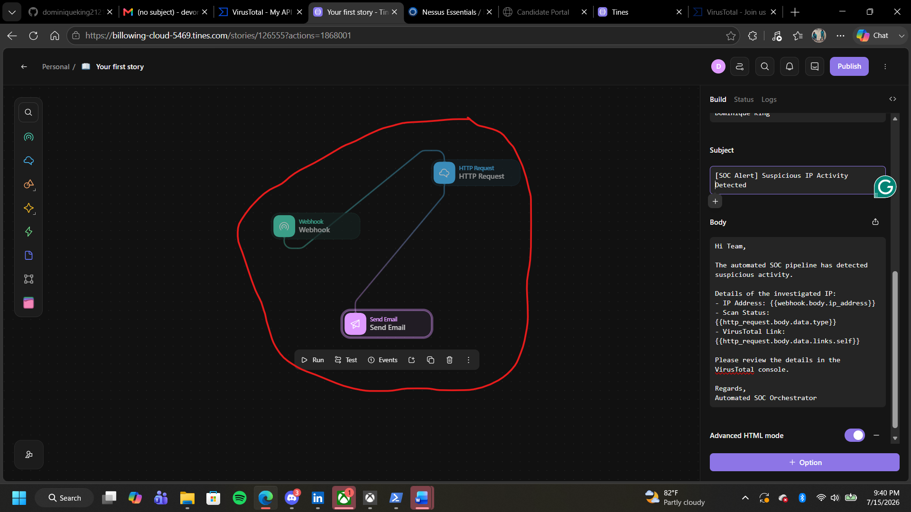
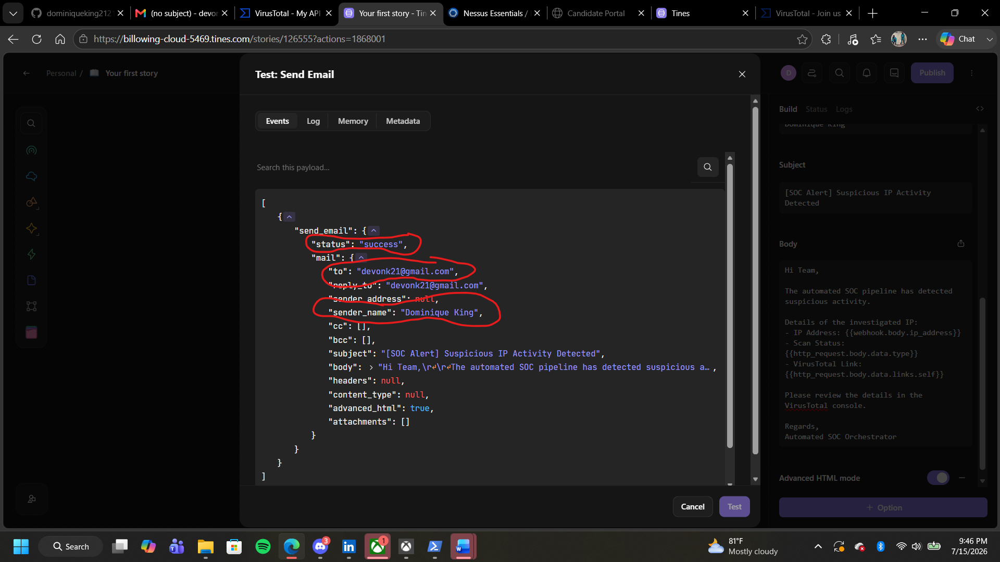
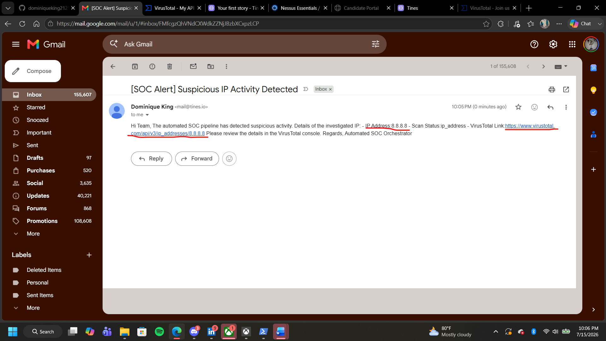

# SOAR Automation & Incident Response Pipeline

Security orchestration, automated threat intelligence enrichment, and dynamic alert generation. This project documents live webhook ingestion, VirusTotal API integration, and automated SOC email notifications.

## Project Deliverables
* **[Click here to view my full Technical Lab Report (PDF)](SOAR_Automation_Lab_Report.pdf)**

---

## Project Walkthrough & Technical Milestones

### Phase 1: Webhook Ingress Configuration & Payload Parsing
To simulate a trigger from an external security tool (like a SIEM or firewall), an inbound HTTP Webhook listener was deployed in Tines. This generated a unique, cloud-hosted webhook URL configured to parse incoming JSON payloads containing the targeted IP address.

### Phase 2: VirusTotal API Connection & Secure Handshake
An HTTP Request block was integrated to dynamically fetch third-party threat intelligence. The VirusTotal API key was securely isolated inside Tines credentials and a static REST GET connection was established using 8.8.8.8 to test authentication and confirm a successful handshake.

### Phase 3: Parsing the API JSON Response
By expanding the parsed payload, the nesting location of the IP attributes, the scan metadata, and the associated console links were isolated.

### Phase 4: Transitioning to Dynamic Variables & Orchestration
With static testing validated, the hardcoded API destination was transformed into a dynamic URL endpoint. Using Tines' data mapping, the flow now programmatically fetches whichever IP address was ingested by the webhook trigger, rendering a modular, reusable pipeline.

### Phase 5: Dynamic Email Alert Mapping & Analyst Notification
A Send Email notification block was constructed to instantly alert analysts. Using Tines' templating engine, plain-text placeholders were replaced with interactive, dynamic data "pills" that pull real-time threat intelligence. The actual final alert was successfully delivered directly to the security inbox.

